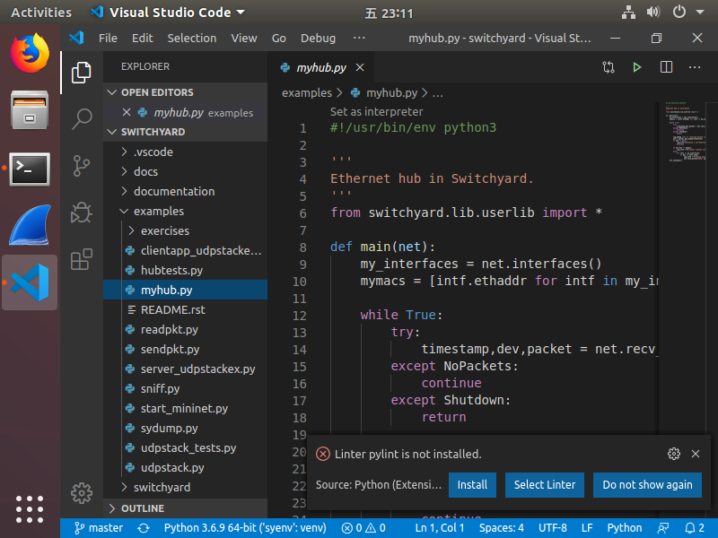

# VS Code

You can use Visual Studio Code (VSC) to develope your projects. I will show how to install it and introduce some plugins may help you. This tutorial is prepared for those who want to take full control of Switchyard in one editor. We use Ubuntu 18.04 here. As we have provided the VM image with VSC preinstalled, you can skip the installation.

We expect that you will cost several hours on this.

## Install VSC

You can choose the VM image with VSC preinstalled. But someone like to install it themselves. The easiest way to install Visual Studio Code for Debian/Ubuntu based distributions is to download and install the [.deb package (64-bit)](https://go.microsoft.com/fwlink/?LinkID=760868), either through the graphical software center if it's available, or through the command line with:

```
sudo apt install ./<file>.deb
```

## Develope Switchyard with VSC

> [!TIP]
> Here we will get in touch with Switchyard in advance. You can just skim the content of Switchyard now. After reading the section [Switchyard](switchyard.md), come back again.

Open the folder of Switchyard in VSC. You can open files in the explorer and edit them.


Then there are some plugins you may want to install. For Python, check this extension and install it.


Next open any Python files and you will see a pop-up message ask you whether you want to install a linter. Pylint is enough to use so install it.



You have got almost every thing you need here. But you may what to format your document by right click on your editor and choose "Format Document". VSC will tell you that you need to install a formatter. Yapf is better for me but you are free to use others.


## Debug Switchyard with VSC

[Switchyard document about debug](https://jsommers.github.io/switchyard/test_execution.html#if-you-don-t-like-pdb) shows that you are free to choose other debuggers. Let's replace pbd with VSC debugger. This will works when running in Switchyard test environment. For VSC, you need to create debugging configuration. The example next shows how to debug `examples/myhub.py` with `examples/hubtests.py`.


Set break point in your code and click the configuration to debug.


## Run Switchyard

This part is not VSC integrated, you need to run Switchyard in the terminal. Read the section [Switchyard](switchyard.md) for more.
