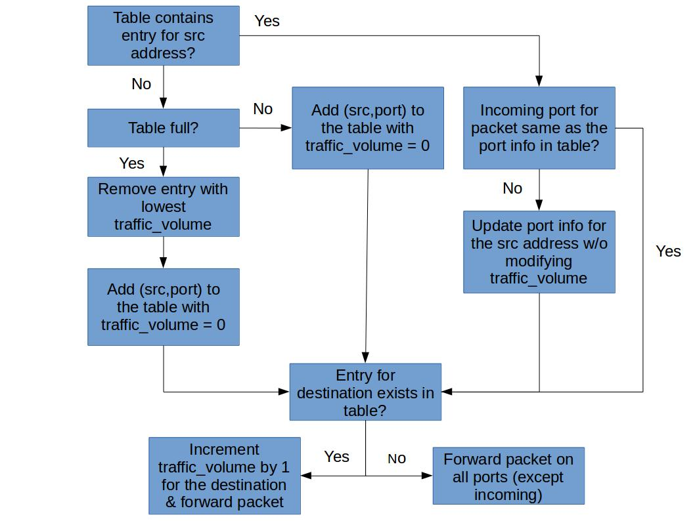

# Task 5: Least Traffic Volume

## Another Limited Storage for Rules Learned

When your switch needs to add a new rule but there is no more space, we can evict the rule that has observed the least amount of network traffic in terms of numbers of packets. In addition, how you count network traffic can be done in different ways: you could also consider number of bytes, or number of *application payload bytes* (ignoring bytes from lower layer headers).

For this functionality assume that your table can only hold 5 entries at a time. Traffic volume for an entry is the **number of packets** that the switch received where `Destination MAC address == MAC address of entry`.

The following flowchart summarizes the algorithm described above.

Your switch may have a table like:

| MAC Address       | Interface   | Traffic Volume |
| ----------------- | ----------- | -------------- |
| ab:cd:ef:fe:cd:ba | interface-0 | 15             |
| ...               | ...         | ...            |

## Coding

Your task is to implement the logic in the above flowchart, using the Switchyard framework. You can start with copying the content of `lab_2/myswitch.py` to `lab_2/myswitch_traffic.py`, which is the only file you'll need to modify.

## Testing

Test your switch with the test file `switchtests_traffic.srpy` we provide.

✅ In the report, show the test result of your switch.  
(Optional) If you have written the test files yourself, show how you test the least traffic volume algorithm.

## Deploying

Run your switch in Mininet.

✅ In Mininet, test the least traffic volume algorithm. Prove that the least traffic volume algorithm works with your testing procedure in the report.
